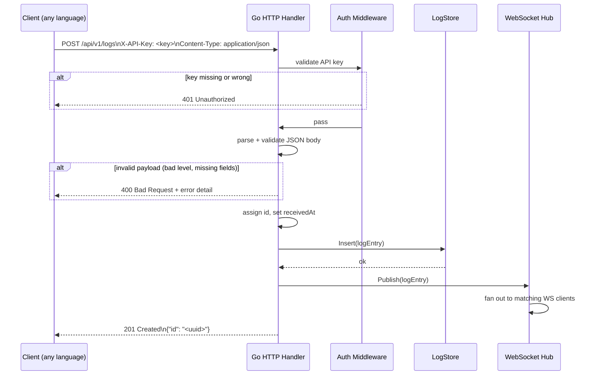
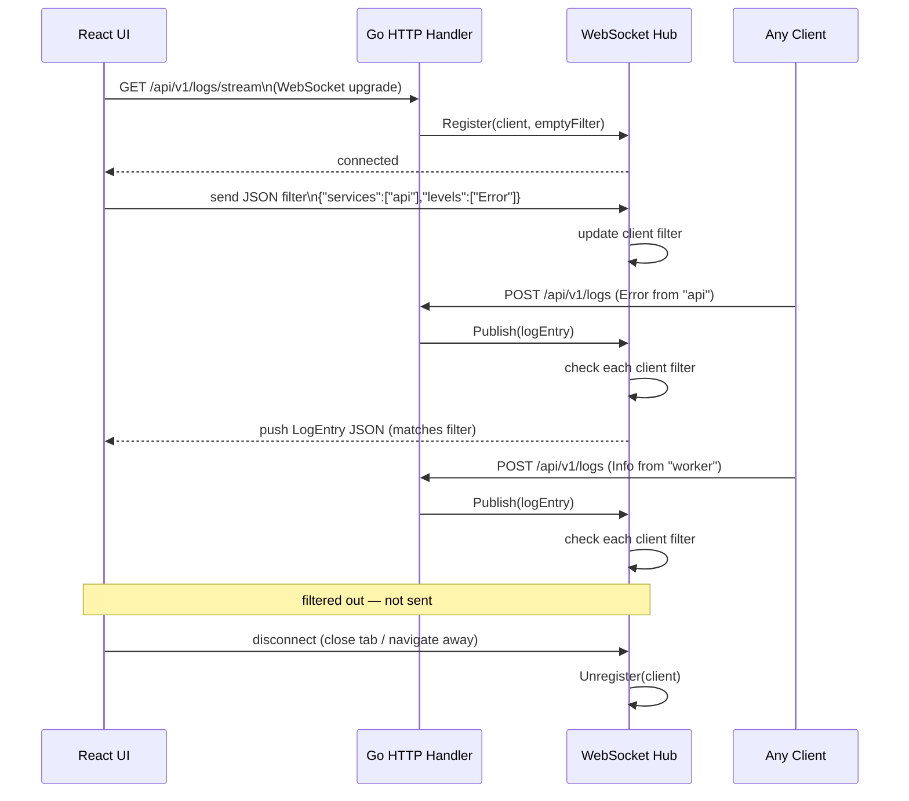
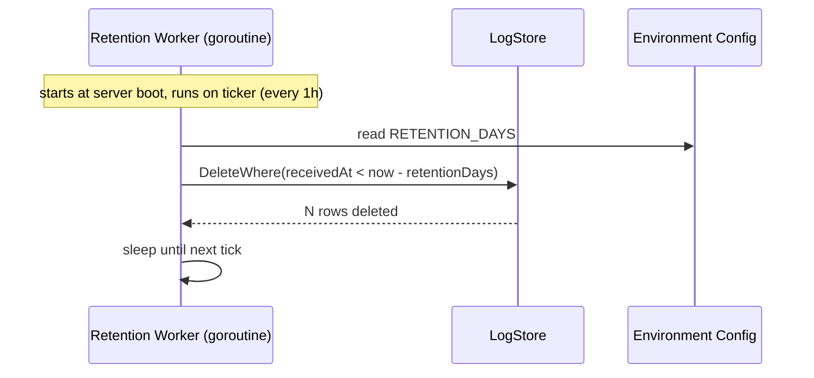

# Sequence Diagrams

## UC-01: Client Sends a Log Event

```mermaid
sequenceDiagram
    participant C as Client (any language)
    participant API as Go HTTP Handler
    participant MW as Auth Middleware
    participant Store as LogStore
    participant Hub as WebSocket Hub

    C->>API: POST /api/v1/logs\nX-API-Key: <key>\nContent-Type: application/json
    API->>MW: validate API key
    alt key missing or wrong
        MW-->>C: 401 Unauthorized
    end
    MW->>API: pass
    API->>API: parse + validate JSON body
    alt invalid payload (bad level, missing fields)
        API-->>C: 400 Bad Request + error detail
    end
    API->>API: assign id, set receivedAt
    API->>Store: Insert(logEntry)
    Store-->>API: ok
    API->>Hub: Publish(logEntry)
    Hub->>Hub: fan out to matching WS clients
    API-->>C: 201 Created\n{"id": "<uuid>"}
```

## UC-03: Developer Live-Tails Logs

```mermaid
sequenceDiagram
    participant UI as React UI
    participant API as Go HTTP Handler
    participant Hub as WebSocket Hub
    participant C as Any Client

    UI->>API: GET /api/v1/logs/stream\n(WebSocket upgrade)
    API->>Hub: Register(client, emptyFilter)
    Hub-->>UI: connected

    UI->>Hub: send JSON filter\n{"services":["api"],"levels":["Error"]}
    Hub->>Hub: update client filter

    C->>API: POST /api/v1/logs (Error from "api")
    API->>Hub: Publish(logEntry)
    Hub->>Hub: check each client filter
    Hub-->>UI: push LogEntry JSON (matches filter)

    C->>API: POST /api/v1/logs (Info from "worker")
    API->>Hub: Publish(logEntry)
    Hub->>Hub: check each client filter
    Note over Hub,UI: filtered out — not sent

    UI->>Hub: disconnect (close tab / navigate away)
    Hub->>Hub: Unregister(client)
```

## UC-04: Retention Worker Purges Old Logs

```mermaid
sequenceDiagram
    participant W as Retention Worker (goroutine)
    participant Store as LogStore
    participant Env as Environment Config

    Note over W: starts at server boot, runs on ticker (every 1h)
    W->>Env: read RETENTION_DAYS
    W->>Store: DeleteWhere(receivedAt < now - retentionDays)
    Store-->>W: N rows deleted
    W->>W: sleep until next tick
```
